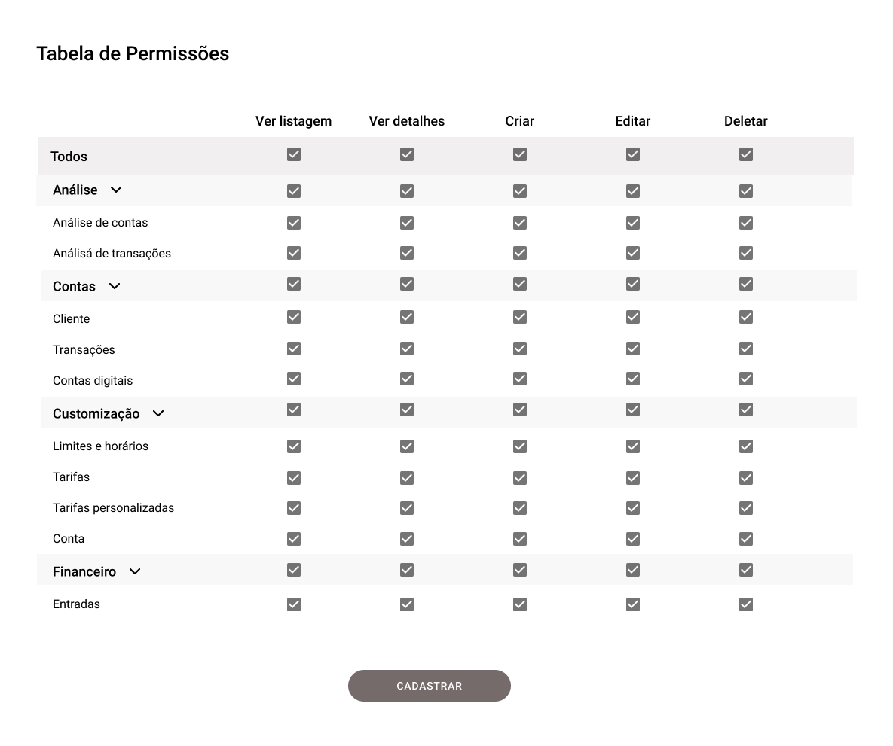

# Desafio Front end

O desafio tem como objetivo avaliar a pessoa candidata nas experiências: 
* Criação de layouts
* Padrões no uso do React.Js
* Boas práticas de programação e organização de projeto

Vale lembrar que iremos avaliar tudo. 

Não deixe de fazer a tarefa, pois conhecimento técnico é um dos pilares da Mobix e sabemos que conhecimento se adquire com o tempo.

## Requisitos

### Obrigatório
- React Hooks
- Testes com Cypress

### Opcionais
- Uso de framework de components: Ant Design, Bootstrap, Material UI
- Redux, Redux Saga
- Styled-components
- TypeScript

### Desafio

Num sistema XPTO, a Tabela de Permissões é uma funcionalidade que define as permissões internas dos usuários.

Na tabela abaixo, temos uma organização de permissão em 6 colunas. Sendo elas: Coluna Vazia, Ver Listagem, Ver Detalhes, Criar, Editar e Deletar.
Obs: Análise, Contas, Customização e Financeiro representam os módulos (estão em cinza mais claro) e em branco são os submódulos.

* Na primeira linha da coluna vazia temos o `Todos` que representa a interação com todos os módulos. 
* Ao clicar no checkbox de `Ver Listagem` do item `Todos`, deve-se habilitar/desabilitar todos os checkbox da coluna de `Ver Listagem`. 
* Essa interação também deve acontecer para `Ver Detalhes`, `Criar`, `Editar` e `Deletar`.

* Na segunda linha da coluna vazia temos a `Análise`, que representa um módulo e ao clicar no checkbox do `Ver Listagem`, deve habilitar/desabilitar o próprio checkbox e os abaixo que representam os submódulos `Análise de Contas` e `Análise de Transações`). 
* Essa interação também deve ser seguido para `Ver Detalhes`, `Criar`, `Editar` e `Deletar`. E também deve ser seguido para os outros módulos.

* Na terceira linha da coluna vazia temos a `Analise de Contas`, que representa um submódulo e ao clicar no checkbox do `Ver Listagem`, deve-se habilitar/desabilitar o próprio checkbox e apenas isso. 
* Essa interação também deve ser seguido para `Ver Detalhes`, `Criar`, `Editar` e `Deletar`. E também deve ser seguido para os outros submódulos.

* É possível abrir e fechar a listagem de submódulos ao clicar na seta apontada para baixo. Ela indica para qual direção o componente terá o comportamento (abertura apontando para cima, fechamento apontando para baixo).

* Ao clicar no botão de cadastrar, deve aparecer no console log todas as permissões dentro de um array, ex: ["permissão1", "permissão2"] e etc.

Link para o Figma https://www.figma.com/file/bLdWjL7pxSdWde02icnhmX/Tabela-de-Permiss%C3%B5es?node-id=1%3A131
